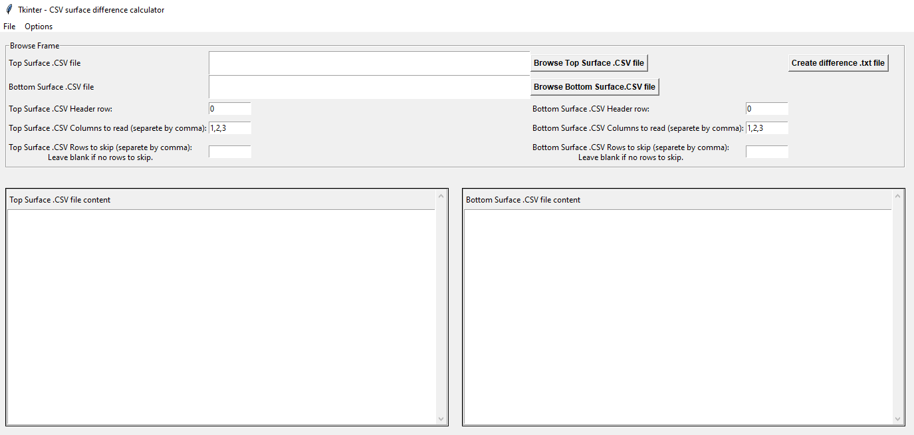

# tkintersurfdiff

## Installation

The code itself doesn't require any installation but it requires a Python installation in the computer system.

## Dependencies

The code has some Python packages dependencies. You can use the command ```pip install ``` followed by a whitespace and the package name in your Python terminal to install the packages into your library.

The list of package dependencies is as follows:

+ pathlib (pahtlib is now part of Python standard library as of Python v3.4) Thus it requires pip installation from v3.3 and earlier.
+ tkinter
+ time
+ scipy
+ pandas
+ numpy
+ ast
+ matplotlib
+ pykrige
+ sklearn
+ pyvista


## Description

In this section I describe the approach for calculating the difference between two surfaces composed of cloud points which is subsequently mapped onto a mesh of quadrilateral elements, using arithmetic averaging or kriging.
Both the red and blue surfaces in Figure 1 are gridded from individual point clouds using PyVista’s [@SullivanKaszynski2019]  package’s 2D Delaunay triangulation method. Each high or low in these surfaces corresponds to a point from the input point cloud. The surfaces correspond to two topographical surfaces represented with 10x vertical exaggeration. PyVista does have the option to measure this space normally to the surface’s cells, but not vertically. Therefore, the code hereby presentedcomputes the space between the two surfaces measured vertically along the z-axis at the resolution of the point clouds.


*Top (red) and bottom (blue) surfaces gridded from points clouds using PyVista’s 2D Delaunay triangulation (Sullivan & Kaszynski, 2019). Five (5)a times vertical exaggeration.*

Due to the fact that the point clouds could be in an unordered/unstructured state and that the two point clouds might (most likely in fact) not share the same XY locations, in which case a simple z-difference would suffice, new points at the same XY locations at the level of the second surface must be created. To accomplish this, one of the surfaces is gridded using a Delaunay triangulation which in effect interpolates 3 points in a continuum. Then, each point of the second cloup point is projected towards the gridded surface and the intersection of that line with the gridded surface creates the point needed at the same XY location. After, a simple z-difference can be calculated. This exercise is illustrated in Figure 2 below. The bottom surface’s points are then projected up towards the gridedd top surface to calculate the intersection points making the z-difference calculation possible. Note that the projections are done in both directions in case the bottom surface has points crossing the gridded top surface, as in the case on the left, rendering a negative space. This is accounted for in the code.


*Representation of the difference calculation between surfaces. The bottom surface (not gridded) points’ (blue) are projected vertically along the z-axis until they cross the top surface (grided). The difference between the bottom surface’s points (blue) and the intersection points (purple) is calculated. The projections are done in both directions in case the gridded surface is below, which renders a negative distance (case on the left).*


### Data

The data required needs to be in a format that is readable by thePython Pandas package, such as tab delimited .txt or .csv files, and they must contain the required XYZ spatial information.
Below an example of the format required:

```
Index	X	Y	Z
0	-43.78	12.89	52.3
1	102.56	-28.6	10.51
...
N	Xn	Yn	Zn
```

The output is a file of the same format (tab delimited) with .txt extension containing the exact same XY locations as the bottom surface in the first two columns as well as the differences in the third column.

### Graphical User Interface (GUI)

The GUI showne below offers an easy-to-use platform to browse the two point clouds' input files and perform the calculations at the click of a button.
The input files' windows provide a way to verify the input files' formats and quickly identify the necessary input parameters (header row, rows to skip and columns to read) without the need to open third-party software.



*Graphical User Interface*

