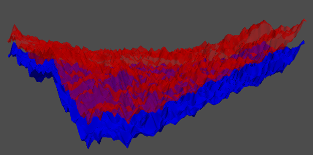

# Calculate difference between point clouds representing two surfaces: a Tkinter Graphical User Interface Python code

Gonçalo Benitez Cunha1

1The University of Edinburgh, Scotland, United Kingdom

Corresponding author: Gonçalo Cunha ([g.cunha@ed.ac.uk](g.cunha@ed.ac.uk))

## 1. Summary

In academic research, as well as in many other industrial applications, there is the need for calculating the distance between points. This is normally a trivial exercise for point-to-point calculation. However, it complicates when the inputs are point clouds instead of single points and even further when these points are not aligned in the dimension of interest, hence a simple arithmetic or trigonometric calculation is not possible. This work elaborates on an approach used to calculate the distance between two point clouds applied to a real-life research application: Calculating the aperture and permeability fields between two surfaces of a rock fracture for Finite Element Method (FEM) numerical modelling.
This calculation is facilitated by a Python-based Graphical User Interface (GUI) which maps the calculated aperture distribution onto a mesh intended for FEM numerical modelling.
Open fractures in rocks facilitate the flow of fluids compared to the porous rock body [REFERENCES], especially in rocks with relatively impermeable rocks. Each fracture face roughness distribution contributes to the distribution of space between the two faces, or aperture of the fracture. The aperture distribution of a fracture is one of the main drivers for permeability of fluids through that fracture.
Fluid flow numerical simulations through fractures rely on representations of fracture aperture fields. Building the models for performing these simulations generally require upscaling of the fracture of aperture field or, as in (McDermott, et al., 2015), the usage of a specific resolution. Particularly when upscaling, averaging is used, which neglects the spatial continuity of the data.
In this paper, we introduce the method of upscaling a Freiberg gneiss’ single rough fracture aperture field using its spatial continuity through a kriging algorithm. The method is then tested by comparing the two methods (arithmetic averaging and kriging) in two different sized meshes in a finite element method (FEM) coupled hydro-mechanical model.
The objective of this study was to utilise a spatial description technique such as the variogram analysis to inform a kriging algorithm in order to better predict the upscaled value of the elements in coupled THMC processes numerical models. In order to assess if this technique was suitable, a comparison was made between fine and coarse models with aperture averaging and kriging using the spatial continuity of the aperture field.

/autoref{fig:TopBottomVExag10}

## 2. Statement of need

The reality.

